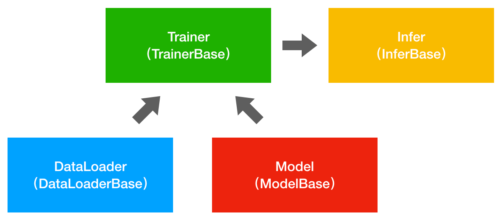

# DL Project Template

深度学习工程模板，简化加载数据、构建网络、训练模型和预测样本的流程。

By C. L. Wang @ 美图云事业部

工程：https://github.com/SpikeKing/DL-Project-Template

## 使用方式

下载工程

```text
git clone https://github.com/SpikeKing/DL-Project-Template
```

创建和激活虚拟环境

```text
virtualenv venv
source venv/bin/activate
```

安装Python依赖库

```text
pip install -r requirements.txt
```

开发流程

1. 定义自己的数据加载类，继承DataLoaderBase；
2. 定义自己的网络结构类，继承ModelBase；
3. 定义自己的模型训练类，继承TrainerBase；
4. 定义自己的样本预测类，继承InferBase；
4. 定义自己的配置文件，写入实验的相关参数；

执行训练模型和预测样本操作。

## 示例工程

识别[MNIST](http://yann.lecun.com/exdb/mnist/)库中手写数字，工程名``simple_mnist``

训练：

```text
python main_train.py -c configs/simple_mnist_config.json
```

预测：

```text
python main_test.py -c configs/simple_mnist_config.json -m simple_mnist.weights.10-0.24.hdf5
```

网络结构


TensorBoard


## 工程架构

### 框架图



### 文件夹结构

```text
├── bases
│   ├── data_loader_base.py             - 数据加载基类
│   ├── infer_base.py                   - 预测样本（推断）基类
│   ├── model_base.py                   - 网络结构（模型）基类
│   ├── trainer_base.py                 - 训练模型基类
├── configs                             - 配置文件夹
│   └── simple_mnist_config.json
├── data_loaders                        - 数据加载文件夹
│   ├── __init__.py
│   ├── simple_mnist_dl.py
├── experiments                         - 实验数据文件夹
│   └── simple_mnist                    - 实验名称
│       ├── checkpoints                 - 存储的模型和参数
│       │   └── simple_mnist.weights.10-0.24.hdf5
│       ├── images                      - 图片
│       │   └── model.png
│       └── logs                        - 日志，如TensorBoard
│           └── events.out.tfevents.1524034653.wang
├── infers                              - 推断文件夹
│   ├── __init__.py
│   ├── simple_mnist_infer.py
├── main_test.py                        - 预测样本入口
├── main_train.py                       - 训练模型入口
├── models                              - 网络结构文件夹
│   ├── __init__.py
│   ├── simple_mnist_model.py
├── requirements.txt                    - 依赖库
├── trainers                            - 训练模型文件夹
│   ├── __init__.py
│   ├── simple_mnist_trainer.py
└── utils                               - 工具文件夹
    ├── __init__.py
    ├── config_utils.py                 - 配置工具类
    ├── np_utils.py                     - NumPy工具类
    ├── utils.py                        - 其他工具类
```

## 主要组件

### DataLoader

操作步骤：

1. 创建自己的加载数据类，继承DataLoaderBase基类；
2. 覆写``get_train_data()``和``get_test_data()``，返回训练和测试数据；

### Model

操作步骤：

1. 创建自己的网络结构类，继承ModelBase基类；
2. 覆写``build_model()``，创建网络结构；
3. 在构造器中，调用``build_model()``；

注意：``plot_model()``支持绘制网络结构；

### Trainer

操作步骤：

1. 创建自己的训练类，继承TrainerBase基类；
2. 参数：网络结构model、训练数据data；
3. 覆写``train()``，fit数据，训练网络结构；

注意：支持在训练中调用callbacks，额外添加模型存储、TensorBoard、FPR度量等。

### Infer

操作步骤：

1. 创建自己的预测类，继承InferBase基类；
2. 覆写``load_model()``，提供模型加载功能；``predict()``，提供样本预测功能；


### Config

定义在模型训练过程中所需的参数，使用JSON格式，参数支持：学习率、Epoch、Batch等。

### Main

训练：

1. 创建配置文件config；
2. 创建数据加载类dl；
3. 创建网络结构类model；
4. 创建训练类trainer，参数是数据加载类dl的训练和测试数据、网络结构类model的模型；
5. 执行训练类trainer的train()；

预测：

1. 创建配置文件config；
2. 处理预测样本test；
3. 创建预测类infer；
4. 执行预测类infer的predict()方法；

## 感谢

参考[Tensorflow-Project-Template](https://github.com/MrGemy95/Tensorflow-Project-Template)


